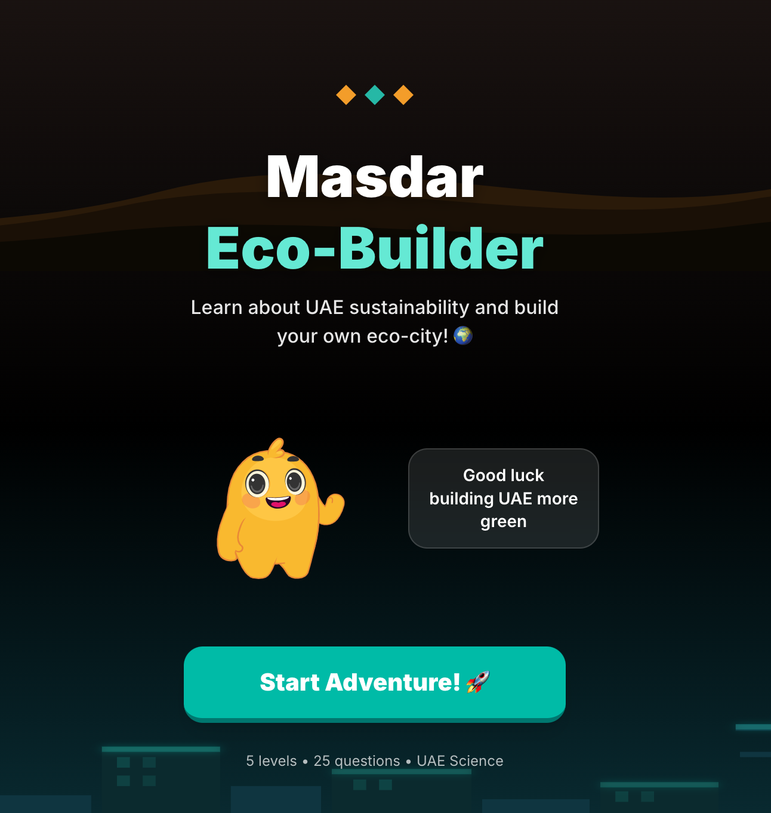
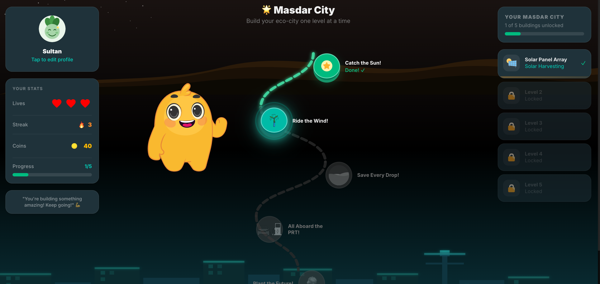
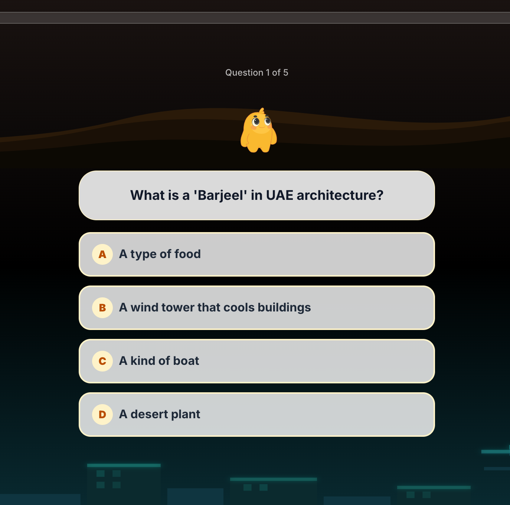
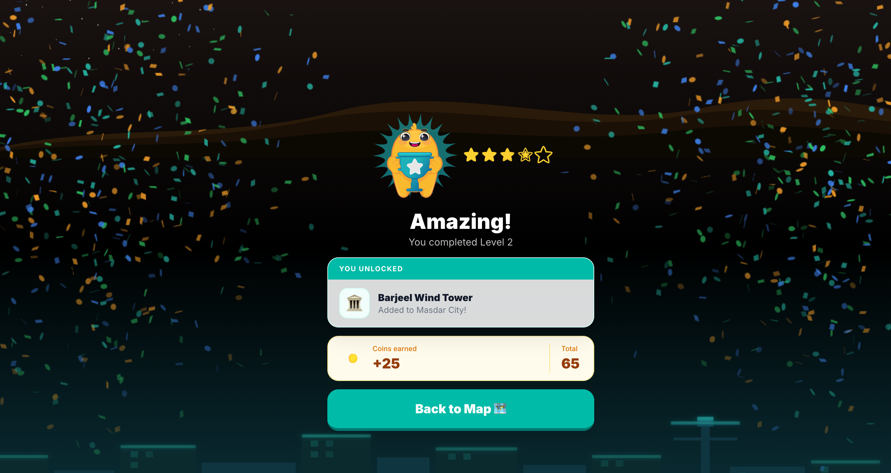
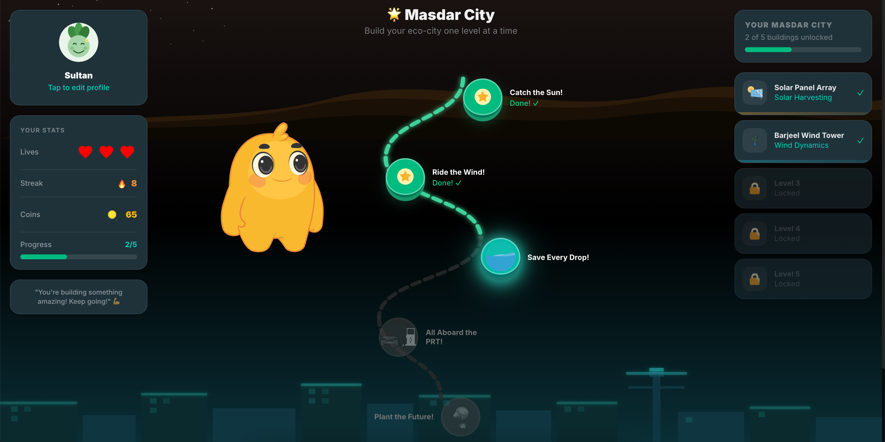

# Masdar Eco-Builder 

**A gamified sustainability quiz app for UAE students — five levels of clean energy science, set in the world's most sustainable city.**

[](https://eco-masdar-city.vercel.app/)


> Built for the **ADEK** (Abu Dhabi Department of Education and Knowledge) Frontend Developer (Interactive UI & Gamification) submission, April 2026.



---

## What it is

Masdar Eco-Builder is a mobile-first quiz game for UAE students. The player lands on a welcome screen with an animated mascot, enters their name, and walks a winding roadmap of five themed levels — each one teaching a pillar of clean-energy science rooted in the UAE context.

There are **five playable levels** today:

- **☀️ Catch the Sun!** *(Solar Harvesting)* · How solar panels work, why the UAE desert is ideal, and the difference between light and heat.
- **🌬️ Ride the Wind!** *(Wind Dynamics)* · From the ancient Barjeel wind tower to modern wind turbines — both use the same desert wind.
- **💧 Save Every Drop!** *(Water Desalination)* · Why the UAE relies on desalination, how it works, and what water conservation means in Masdar City.
- **🚋 All Aboard the PRT!** *(Public Transit)* · Masdar City's driverless Personal Rapid Transit pods and why electric vehicles matter.
- **🌳 Plant the Future!** *(Green Canopy)* · The UAE's national Ghaf tree, photosynthesis, and how green spaces cool a desert city.

Each level delivers a description card, then five questions (multiple-choice and true/false). A wrong answer costs a life (3 max). Completing a level unlocks a city building — Solar Panel Array, Barjeel Wind Tower, Green Water Plant, PRT Pod Station, or Ghaf Tree Park — visible in the City Stats sidebar. Coins earned fund a rank progression from Newcomer through six tiers up to Eco Master.

---

## How it maps to the 5 evaluation criteria

| # | Criterion | Where to look |
|---|---|---|
| 1 | **UAE cultural integration** | All five levels are anchored in UAE-specific science: the Barjeel wind tower, the Ghaf national tree, Masdar City's PRT system, UAE desalination infrastructure. Currency is coins earned for correct answers. Buildings that unlock have UAE names and context. The default player name is *Sultan*. The welcome screen tagline references the UAE directly. |
| 2 | **Visual design quality** | Dark-teal `#121212` background with per-level accent colors (`#f59e0b` amber for Solar, `#06b6d4` cyan for Wind, `#3b82f6` blue for Water, `#8b5cf6` purple for PRT, `#22c55e` green for Nature). Geometric diamond decorations, rank-ring avatar, and a consistent card grammar — rounded-2xl surfaces, subtle glass backdrops — applied across every screen. Desktop gets a two-sidebar layout with city progress on the right and player stats on the left. |
| 3 | **UI/UX quality** | Mobile-first with a bottom stats bar (lives, streak, coins), a bottom-sheet level-intro that slides up before the quiz starts, and a tap-to-open full-screen profile overlay. Desktop uses `right: calc(50% + 196px)` to pin the mascot to the center lane as the sidebars change width. Level nodes are clearly locked, active, or completed. The intro sheet always previews what building the level will unlock. |
| 4 | **Micro-animations** | A Lottie-based mascot state machine drives context-aware sequences: `idle → wave → happy → idle` on the welcome screen, `correct/happy` or `wrong` per quiz answer (chained via `onComplete`), and a repeating `wave` loop on the map. `key={state}` on the Lottie component forces a clean remount on every transition — no mid-animation corruption. Screen transitions use Framer Motion `AnimatePresence` (300ms fade + scale). Canvas-confetti fires on level victory. Nine Web Audio API tones — tap, node-click, correct, wrong, heart-loss, level-start, victory, coin, slide — are generated procedurally with no audio files shipped. |
| 5 | **Student journey flow** | A single linear map gates each level behind the previous one. The intro sheet previews the topic and the building reward before the student commits. Wrong answers shake feedback in immediately with an explanation. Running out of 3 lives sends the student to a Game Over screen with a retry option — no harsh penalty, just another go. Victory celebrates with confetti, shows coins earned and rank progress, and pulses the next unlocked node to draw the eye forward. |

---

## Quick start

```bash
git clone <this-repo>
cd masdar-eco-builder
npm install
npm run dev          # http://localhost:3000

# other scripts
npm run build        # production build
npm run start        # serve the production build
npm test             # Jest + React Testing Library (187 tests)
npm run test:watch   # watch mode
npm run lint         # ESLint (next/core-web-vitals)
```

**Requirements:** Node 20+, npm. No backend, no auth, no Docker. All progress lives in the browser via Zustand `persist` middleware (key: `masdar-game-state`).

> 💡 **Reviewer tip:** open [eco-masdar-city.vercel.app](https://eco-masdar-city.vercel.app/) in a fresh private window to walk the full flow from the welcome screen. To replay, reset progress via the in-app Profile screen or call `useGameStore.setState({ ...initialState })` in devtools.

---

## A short tour

### 1. Welcome screen

Animated mascot runs `idle → wave → happy → idle` on a 3-second timer. A glassmorphic speech bubble and a teal CTA button fade in sequentially with staggered delays. A procedurally generated `playLevelStart` tone fires on tap.


### 2. The map

A winding roadmap with five level nodes — locked (padlock), active (pulsing ring), or completed (checkmark). The mascot floats in the center lane via absolute positioning calibrated against the sidebar boundary. Tapping a node slides up the intro sheet from the bottom.



### 3. Quiz screen

Hearts row (3 max) at the top, question card in the center, four answer options below. Correct → mascot switches to `happy` state + ascending C5–E5–G5 chime. Wrong → mascot switches to `wrong` state + descending square-wave buzz, and a life is deducted with a thud impact tone. Every answer shows an explanation card before the next question loads.



### 4. Victory screen

Level complete: canvas-confetti burst, coins earned displayed, rank-up if a threshold was crossed, and the newly unlocked building revealed with its icon. A "Back to Map" button returns to the roadmap where the next node now pulses.



### 5. Game over screen

Three lives gone: mascot holds the `wrong` state, a retry button replays the current level, and a quit button returns to the map without losing the unlocked level state.

### 6. Desktop layout

On viewports above the mobile breakpoint: left sidebar shows the player card (avatar with rank ring, coins, streak, lives) and a profile button; right sidebar shows the city progress panel — every unlocked building displayed with its Lottie animation. The mascot is pinned to the center lane between the two sidebars.




---

## Tech stack

| Tech | Version | What it does here |
|---|---|---|
| **Next.js** | 16.2.4 | App Router, single-page orchestrator with `AnimatePresence` screen routing |
| **React** | 19.2.4 | UI library |
| **TypeScript** | strict | Type safety end-to-end — `GameState`, `GameActions`, `Level`, `Question` |
| **Tailwind CSS** | v4 | Per-level accent colors, dark base palette, responsive utility classes |
| **Framer Motion** | 12 | `AnimatePresence` screen transitions, staggered mount animations, `whileTap` button physics |
| **Zustand** | 5 | Persisted game state (key: `masdar-game-state`, `skipHydration: true`) |
| **lottie-react** | 2.4 | Mascot state machine + animated city building icons |
| **canvas-confetti** | 1.9 | Victory celebration burst |
| **Web Audio API** | native | 9 procedurally generated UI sounds — no audio files shipped |
| **Jest + RTL** | 30 / 16 | Unit + component + store tests (187 tests · 19 suites) |

No external API. No backend. No Docker.

---

## Project structure

```
├── app/
│   ├── page.tsx              # Screen orchestrator: manages 5 screens + AnimatePresence transitions
│   ├── layout.tsx            # Root layout + providers
│   └── globals.css           # Base styles + Tailwind v4 config
│
├── components/
│   ├── map/
│   │   ├── MapScreen.tsx     # Winding roadmap, mascot, sidebars
│   │   ├── LevelNode.tsx     # Single node (locked / active / completed states)
│   │   └── LevelIntroSheet.tsx  # Bottom-sheet level preview before quiz
│   ├── quiz/
│   │   ├── QuizScreen.tsx    # Question/answer flow with mascot feedback
│   │   ├── VictoryScreen.tsx # Level-complete screen with confetti + coin count
│   │   └── GameOverScreen.tsx   # Lives-depleted screen with retry/quit
│   └── ui/
│       ├── MascotAnimation.tsx  # Lottie state machine (idle/wave/happy/correct/wrong)
│       ├── ProfileScreen.tsx    # Full-screen profile overlay
│       ├── DesktopSidebar.tsx   # Left sidebar: player stats + profile card
│       ├── CityStatsPanel.tsx   # Right sidebar: city building progress
│       ├── StatsBar.tsx         # Mobile top bar: lives, streak, coins
│       ├── CartoonAvatar.tsx    # Initials-based avatar with rank ring
│       ├── AnimatedIcons.tsx    # Lottie-wrapped building icon components
│       ├── WelcomeScreen.tsx    # Landing screen with mascot + CTA
│       ├── RoadmapBackground.tsx
│       └── HydrationProvider.tsx
│
├── store/
│   └── gameStore.ts          # Single Zustand store (state + actions + persist)
│
├── data/
│   └── levels.json           # 5 levels × 5 questions with correct answer indices + explanations
│
├── hooks/
│   ├── useSounds.ts          # Web Audio API — 9 procedurally generated tones
│   └── useLevelData.ts       # Level data access with derived LevelStatus
│
├── types/
│   └── index.ts              # GameState, GameActions, Level, Question, LevelStatus
│
├── public/
│   ├── assets/               # Lottie JSON files (buildings, icons, stars, locks)
│   └── mascot/               # 5 mascot state JSONs (idle, wave, happy, correct, wrong)
│
└── __tests__/                # 19 test files — mirrors component structure
```

---

## State management

A single Zustand store (`store/gameStore.ts`) with `persist` middleware writes everything to localStorage under the key `masdar-game-state`:

```ts
interface GameState {
  coins: number;
  currentStreak: number;
  lives: number;                    // 3 max, resets on new level
  unlockedLevels: number[];         // starts [1], grows as levels complete
  completedLevels: number[];
  newlyUnlocked: number | null;     // pulse signal for the next node
  hydrated: boolean;                // SSR safety flag
  playerName: string;               // default: 'Sultan'
}
```

`skipHydration: true` prevents React hydration mismatches on Next.js App Router. A `HydrationProvider` wrapper calls `rehydrate()` client-side after mount, so the server-rendered HTML and the localStorage-rehydrated state always match on first paint.

Rank is derived — not stored — computed at render time from `completedLevels.length`:

| Levels completed | Rank |
|---|---|
| 0 | Newcomer |
| 1 | Eco Learner |
| 2 | Green Scout |
| 3 | Solar Ranger |
| 4 | Energy Champion |
| 5 | Eco Master |

---

## Quiz flow

`QuizScreen` drives one level. Per level:

- **3 lives**. Each wrong answer costs one + fires a `playHeartLoss` thud. Run out → `onGameOver` callback, player lands on `GameOverScreen`.
- **5 questions per level** from `data/levels.json`. Two types:

| Type | What the student does |
|---|---|
| `multiple_choice` | Picks the correct option from up to 4 large tappable cards |
| `true_false` | Picks True or False on a stated claim |

- **Immediate feedback** after each answer: explanation text appears, mascot switches state (`happy` or `wrong`), and a tone plays before the next question loads.
- **Streak tracking** — consecutive correct answers increment `currentStreak` in the store; a wrong answer resets it to 0.
- **Level complete** → `coins` awarded (20–35 per level), next level unlocked, `newlyUnlocked` set to pulse the next node, confetti fires, and the victory screen slides in.

---

## Sound design

All sounds are generated live via the Web Audio API (`hooks/useSounds.ts`) — no audio files, no network requests. Just messing around with frequencies and oscillator types to give each interaction its own feel.

---

## Testing

**187 tests · 19 suites · 0 failures**

```bash
npm test              # run once
npm run test:watch    # TDD mode
```

| Scope | Files | What's covered |
|---|---|---|
| Store | `gameStore.test.ts` | All actions: coins, lives, streaks, level unlocks, playerName |
| Hooks | `useSounds`, `useLevelData` | Return shapes, derived status values |
| UI components | 10 files | Render output, store integration, user interactions |
| Map components | 3 files | Level nodes (all 3 states), intro sheet, full MapScreen flow |
| Quiz components | 3 files | Answer selection, mascot state transitions, victory/gameover flows |
| App orchestration | `page.test.tsx` | All 5 screen transitions and their callback wiring |

**Key mocking patterns:**
- `lottie-react` → renders `<div data-testid="lottie">` stub
- `framer-motion` → strips animation props, passes through children
- `useSounds` → all functions replaced with `jest.fn()`
- Store reset per test: `useGameStore.setState({ ...initialState })`

---

## Design decisions

**Why Zustand over Redux Toolkit**
The game state is entirely client-side with no server sync. Zustand's partial `setState` and direct `getState()` access made test setup trivial — one `useGameStore.setState({ ...initialState })` call resets everything. Redux would have added significant boilerplate with no benefit for a self-contained game store.

**Why `key={state}` on Lottie**
Without forcing a remount, switching Lottie's `animationData` prop mid-play leaves the animation at an intermediate frame. The `key` prop tears down and recreates the component on state change — the correct React idiom for "reset this to initial state." This is what makes the mascot's `happy` → `idle` chain feel instant and reliable.

**Why `skipHydration: true` on persist**
Next.js App Router renders on the server where `localStorage` doesn't exist. Without this flag, Zustand initializes from `localStorage` on the client and triggers a React hydration warning because the initial client tree differs from the server-rendered HTML. The `HydrationProvider` defers rehydration to after the first client render, so both trees match.

**Why procedural audio over audio files**
Nine Web Audio API tones cover every interaction with zero network requests, zero asset management, and zero licensing. Each tone is shaped with exponential frequency ramps and gain envelopes — the result sounds designed rather than generated. The `AudioContext` is created lazily to respect browser autoplay policy.

**Why per-level accent colors**
Each of the five clean-energy topics gets its own hue: amber for solar, cyan for wind, blue for water, purple for transit, green for nature. The color is applied to the level node, the intro sheet header, the quiz card border, and the victory screen — giving each topic a distinct feel without needing custom assets per level.

**UAE science as the frame, not decoration**
The Barjeel wind tower, the Ghaf tree, Masdar City's PRT, and UAE desalination infrastructure aren't name-dropped once — they're the *question content*. A student who plays all five levels finishes knowing why the UAE is a world leader in clean energy, not just that renewable energy exists.

---

